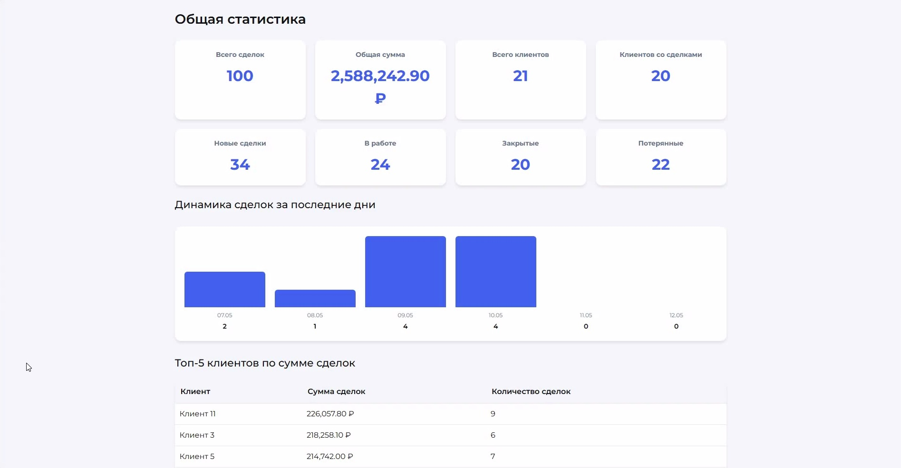
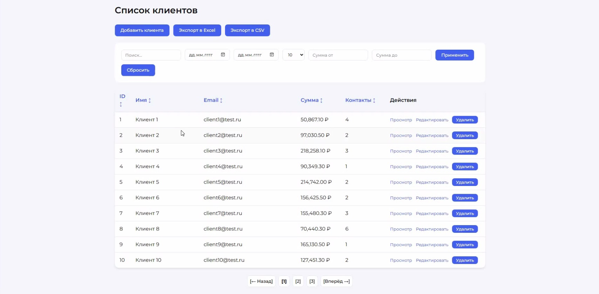
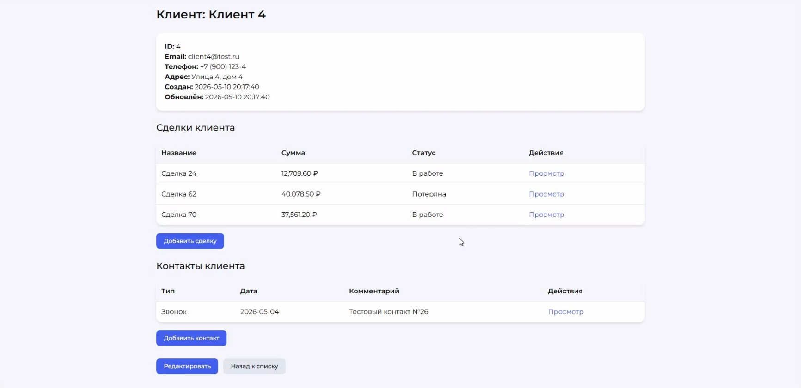
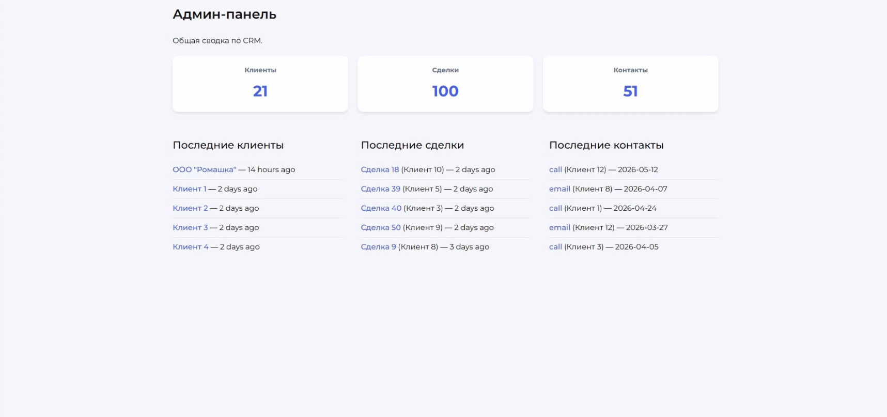

# CRM

Система управления клиентами, сделками и контактами.

[](https://www.php.net/)
[](https://laravel.com/)

## О чем этот проект?

**CRM** — это полнофункциональная система для управления взаимоотношениями с клиентами. Проект разработан на **Laravel 10** и включает полный набор функций для работы с клиентами, сделками и контактами.

Система позволяет вести учёт клиентов, отслеживать сделки, управлять контактами, строить отчёты и выгружать данные в Excel.

## Видео-демонстрация

[Смотреть демонстрацию](https://disk.yandex.ru/i/8ssaiW0TL7Dn6g) (нажмите с Ctrl или Cmd, чтобы открыть в новой вкладке)

## Скриншоты

Дашборд



Список клиентов



Страница данных о клиенте



Админ-панель



## Возможности системы

### Для пользователя
- Регистрация и вход в систему.
- Управление клиентами (CRUD + поиск + фильтры).
- Управление сделками (CRUD + поиск + фильтры по статусу, дате, сумме).
- Управление контактами (CRUD + фильтры по типу, дате, клиенту).
- Сортировка и пагинация с выбором количества записей.
- Экспорт данных в Excel/CSV.
- Дашборд с приветствием, карточками статистики и быстрыми ссылками.
- Отчёты: динамика сделок, топ-5 клиентов, воронка продаж, отчёт по месяцам.

### Для администратора
- Сводная статистика по системе.
- Полный доступ ко всем данным.
- Управление пользователями (при необходимости).

### API
- REST API для всех сущностей (клиенты, сделки, контакты).
- Ответы в формате JSON.
- Полная документация по эндпоинтам.

## Быстрый старт (Локальная разработка)

> [!NOTE]
> Подробное руководство по настройке SMTP, Supervisor и структуре базы данных находится в папке [`/docs`](docs/INSTALLATION.md).

1.  **Клонируйте репозиторий и установите зависимости:**
    ```bash
    git clone https://github.com/Anton-Nevezhin/crm.git
    cd crm
    composer install
    ```

2.  **Настройте окружение:**
    ```bash
    cp .env.example .env
    php artisan key:generate
    ```

3.  **Запустите базу данных:**
    ```bash
    # Создайте БД MySQL "crm" и выполните миграции
    php artisan migrate --seed
    ```

4.  **Запустите сервер:**
    ```bash
    php artisan serve
    ```

Откройте http://127.0.0.1:8000. Зарегистрируйте первого пользователя — он получит доступ ко всем разделам.

## API

Все эндпоинты возвращают данные в формате JSON.

| Метод | Эндпоинт | Описание |
|-------|----------|----------|
| GET    | /api/clients      | Список клиентов |
| POST   | /api/clients      | Создать клиента |
| GET    | /api/clients/{id} | Просмотр клиента |
| PUT    | /api/clients/{id} | Обновить клиента |
| DELETE | /api/clients/{id} | Удалить клиента |

Аналогичные эндпоинты доступны для `/api/deals` и `/api/contacts`.

## Тесты

В проекте используется PHPUnit. Чтобы убедиться, что всё работает корректно:

```bash
php artisan test
```

Ожидаемый результат: 29 тестов, 70 ассертов — всё зелёное.

## Технологии

- Laravel 10
- PHP 8.1
- MySQL
- Laravel Breeze (аутентификация)
- PHPUnit (тесты)
- PhpSpreadsheet (Excel)
- Git / GitHub

## Планируемые улучшения

- Роли пользователей (админ, менеджер)
- Docker-контейнеризация

Контакты
По вопросам сотрудничества и поддержки обращайтесь к автору репозитория на GitHub.

Сделано с заботой о данных. 🤝
